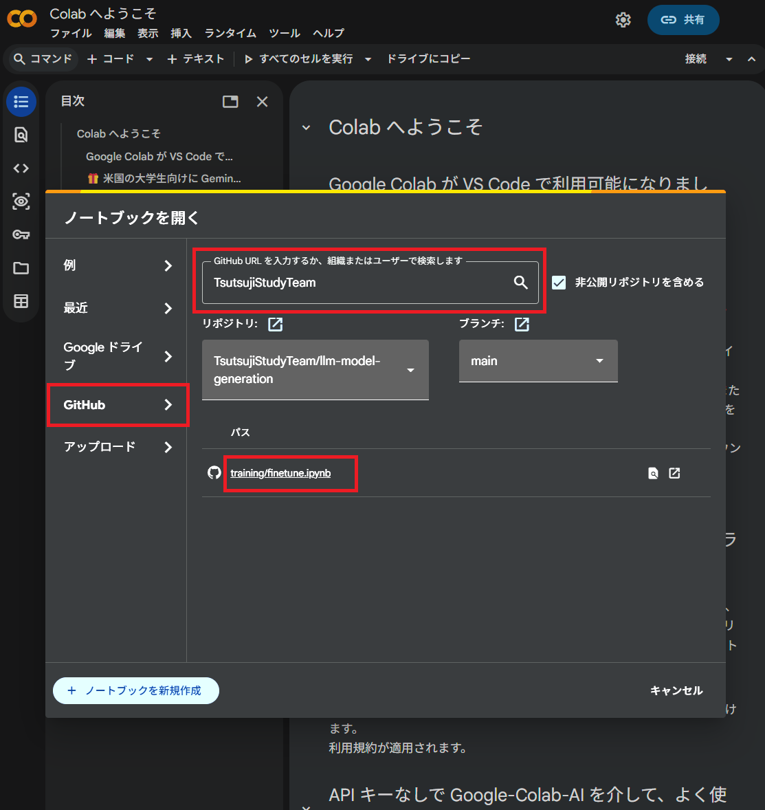
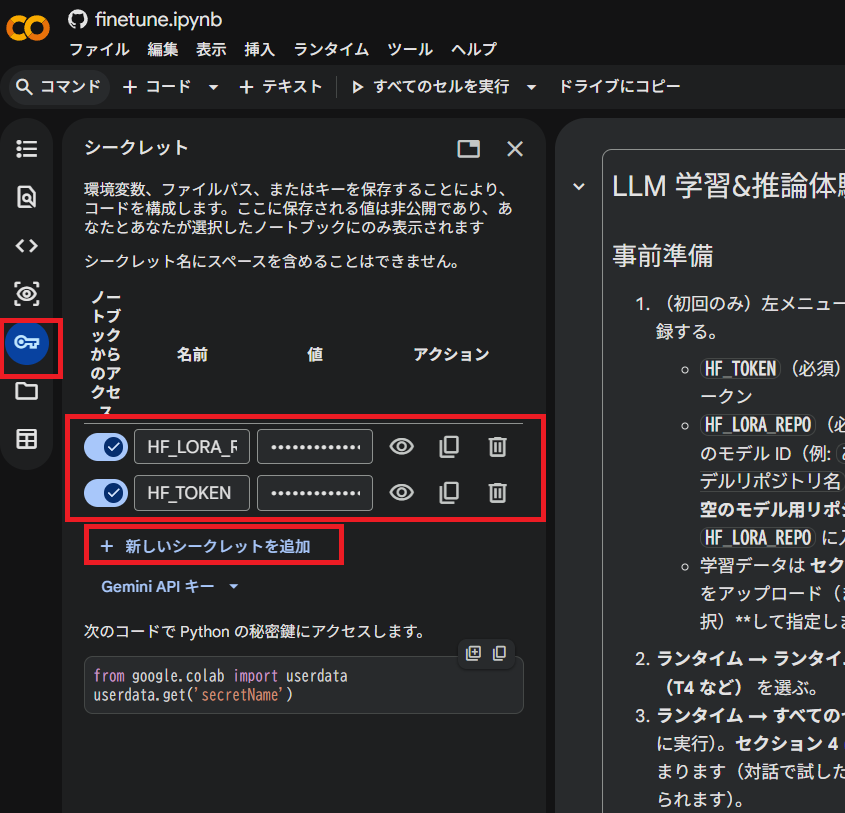
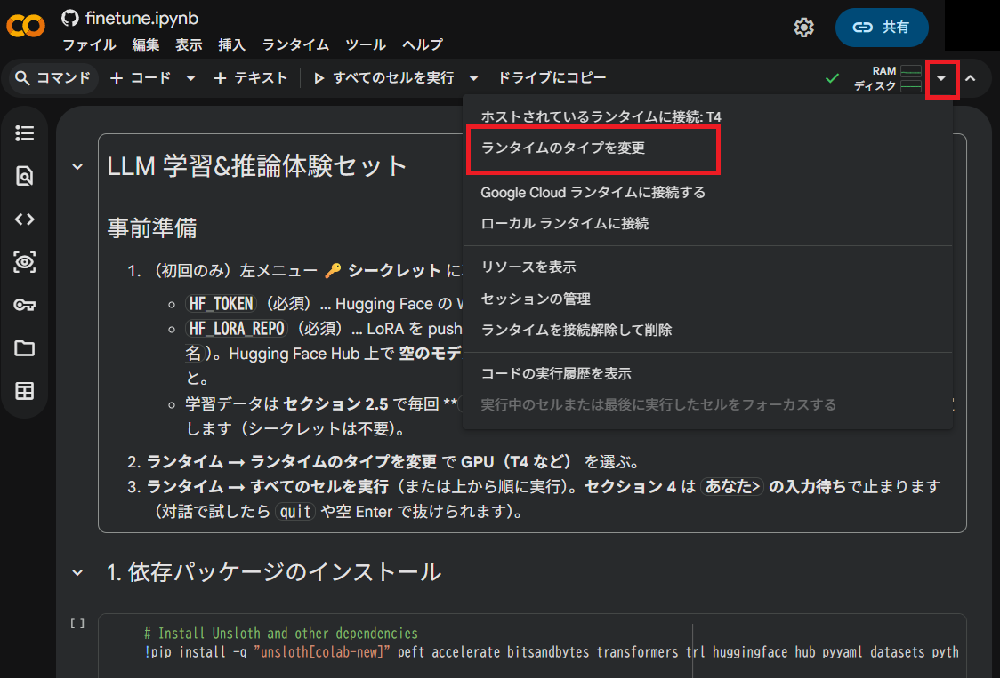
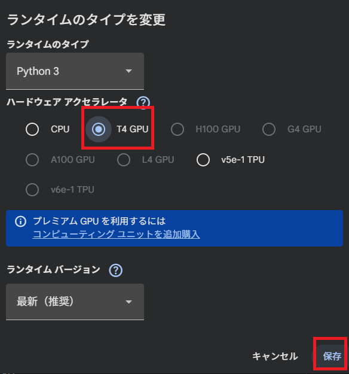
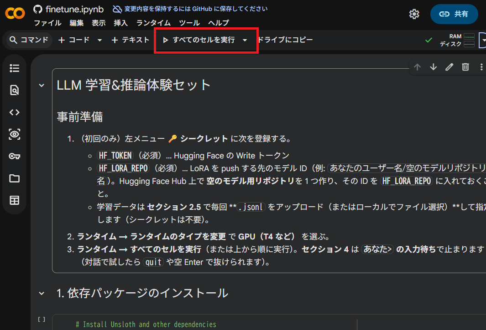
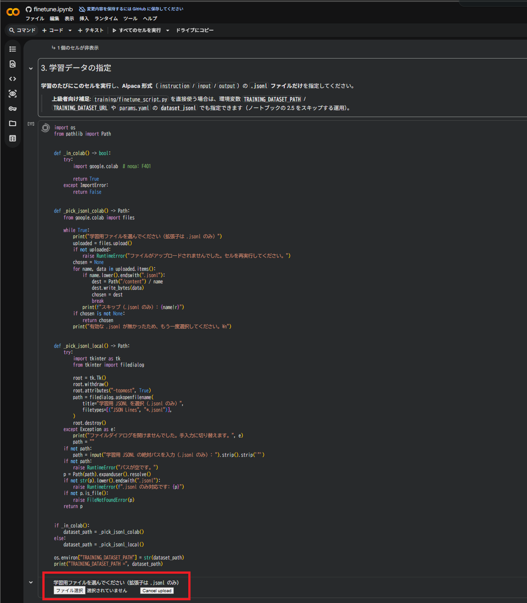
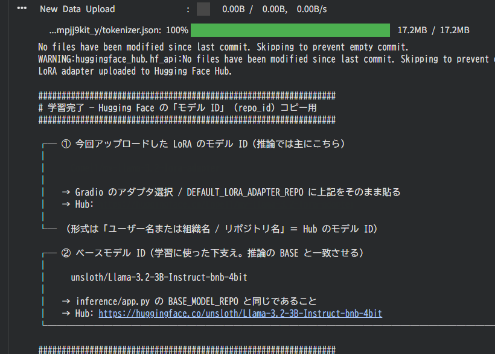
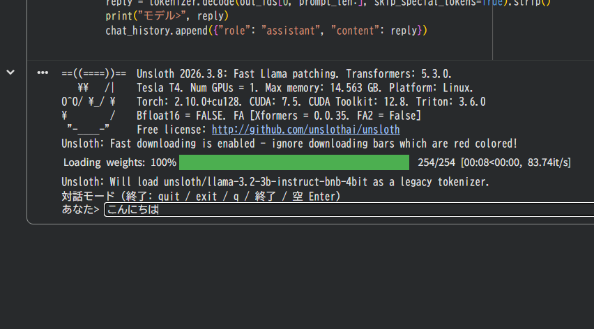
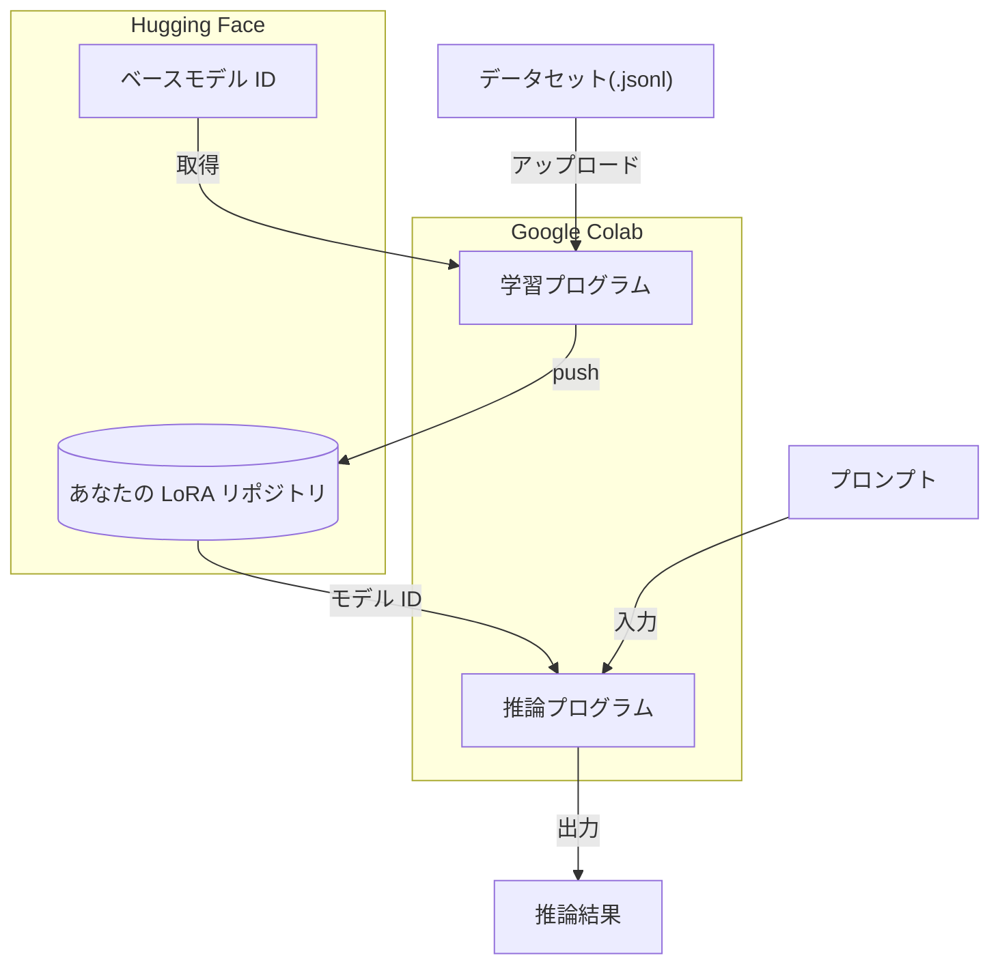

# ✨ LLM 学習&推論 体験キット ✨

## 🌟 1. プロジェクト概要

- このプロジェクトは、Hagging Faceアカウントさえあれば完全無料・環境構築一切不要でLLMの学習～推論を実施する事ができるプロうグラムです。 Google Colab と Hugging Face Hub を活用し、コストをかけずに LLM の学習から推論までを体験する事ができます。
- Google Colab上で学習処理を行い、作成されたモデルをHagging Face Hub上に格納、そのモデルを使用してGoogle Colab上で推論を実施する、という仕組みです。
- 無料で使用できるという観点からオープンソースのLLMである **Llama** をベースモデルに採用し、短時間で学習が実施できるという観点で学習手法には **LoRA** を採用しています。

下記に本プロジェクトで登場する重要なワードの説明をします。

| 概要 | 説明 |
| --- | --- |
| **Google Colabとは？** | ブラウザ上で誰でも無料で **プログラム（Python）** が実行できる、Googleのサービスです。GPUリソースを利用した学習や推論処理を動かすことも可能なため、GPU付きのPCを持っていなくても重い学習処理などを実行する事ができます。このプロジェクトではGoogle Colab上で学習を実行する事を前提に開発されています。 |
| **LoRAとは？** | **Lo**w-**R**ank **A**daptation の略で、大規模言語モデル全体を書き換えず、**ごく一部の追加パラメータだけを学習**して用途に合わせる手法です。学習・保存の負担が小さく、元モデルに **アダプタ**（差分の重み）を足す形で配布しやすいのが特徴です。また、学習した結果出力される「元モデル + アダプタ」の事を指して「LoRA」と呼ぶ事もあります。 |
| **Hugging Faceとは？** | 機械学習のモデル・データセット・ツールを集めたコミュニティとサービスで、**Hugging Face Hub** 上にモデルを公開・配布できます。本プロジェクトでは、学習に使う **ベースモデル（Llama 4bit など）を Hub から取得**し、学習後に付け足した **LoRA をあなた専用の空リポジトリへアップロード**します。アクセスには **Access Token**（Colab ではシークレット `HF_TOKEN`）を使います。 |
| **アダプタとは？** | ここでは **LoRA で学習した「追加パーツ」＝差分の重み一式**を指します。ベースの Llama 本体は Hub 上の共有モデルのまま利用し、**あなたが学習した分だけ**を **別の Hub リポジトリ（シークレット `HF_LORA_REPO`）へ push** します。推論では **先にベースモデルを読み込み、その後このアダプタを重ねて読み込む**ことで、学習した内容を反映した応答が得られます。 |
| **Unslothとは？** | **Llama などの LLM の学習・推論を速くし、GPU メモリを抑える**ためのライブラリです。一般の PC 向け GPU や Colab の GPU でもLLMを扱いやすくなります。本プロジェクトでは Unsloth 経由でモデルを読み込み、LoRA で学習を行う仕様になっています。 |
| **Llamaとは？** | Meta が公開している **大規模言語モデル（LLM）のシリーズ名**です（Llama 2／3 など世代があります）。本プロジェクトでは、Hugging Face Hub 上の **Llama 3.2 系・4bit 版（Unsloth が配布しているビルドのもの）**を **ベースモデル**としてダウンロードし、その上に **LoRA で追加学習**します。 |

## 🛠️ 2. 事前準備手順

学習・推論を体験する前に下記の準備をする事

### 2-1. Hugging Face アカウントとトークンの発行

1. ✅ [Hugging Face](https://huggingface.co/join) でアカウントを作成します。
2. 🔑 **Access Token（Write）**  を作成します。
    - [Settings → Access Tokens](https://huggingface.co/settings/tokens) で **Write** 権限のトークンを作成します。この値は忘れずにメモしておいてください。（流出しないよう扱いに気を付けること）

### 2-2. Hugging Face に LoRA 用の空リポジトリを準備

1. [Hugging Face](https://huggingface.co/new) で **New model**（または同等の「新しいモデル用リポジトリ」）を作成する。  
2. 表示されている **`namespace/リポジトリ名`** を覚える、またはメモしておくこと。後段の作業で使用します。


## ▶️ 3. 実行手順

### 3-1. LLMに学習させる手順

#### 手順

| ステップ | 操作内容 | 詳細・入力事項 |
| :--- | :--- | :--- |
| **1** | **Colabにアクセス** | [Google Colab 公式](https://colab.research.google.com/?hl=ja) を開く |
| **2** | **GitHubから読み込み** | 「ノートブックを開く」→ 左側の **[GitHub]** タブを選択 |
| **3** | **組織を検索** | 検索窓に `TsutsujiStudyTeam` と入力し検索 |
| **4** | **リポジトリを選択** | リポジトリ：`llm-model-generation`<br>ブランチ：`main` を選択 |
| **5** | **ファイルを開く** | `training/finetune.ipynb` をクリック  |
| **6** | **シークレット設定** | 左メニューの **鍵マーク（🔑）** を選択 |
| **7** | **トークンの登録** | 「新しいシークレットを追加」から以下を登録<br>・`HF_TOKEN`：Hugging Faceで発行したトークン<br>・`HF_LORA_REPO`：`ユーザー名/リポジトリ名`  |
| **8** | **目次へ戻る** | 左メニューの **目次アイコン** を選択 |
| **9** | **ランタイム設定** | 右上の「▼」→ **[ランタイムのタイプを変更]**  |
| **10** | **GPUを選択** | ハードウェアアクセラレータで **[T4 GPU]** を選択し保存  |
| **11** | **実行開始** | メニューの **[ランタイム]** → **[すべてのセルを実行]**  |
| **12** | **学習対象のファイルを選択** | 「学習用ファイルを選んでください」が表示されたらJSONL拡張子のファイルを選択してアップロードする（このリポジトリにデータセットサンプルとして用意されている「data/dataset.jsonl」を選択してみてください）  |
| **13** | **完了確認** | 「3. 学習の実行」セルの出力に<br>**`# 学習完了 — Hugging Face の「モデル ID」`** が出れば成功  |

### 3-2. 学習させたモデルで推論する手順

#### A. Google Colabで実行する場合の手順【推奨】
特別な理由が無い限りGoogle Colabでの実施をおすすめします。

| ステップ | 操作内容 | 詳細・入力事項 |
| :--- | :--- | :--- |
| **1** | **学習を実行する** |  **LLMに学習させる手順** を完了させる。 |
| **2** | **セクション 4（対話推論）を実行する** | **「4. 推論の実行（対話）」** のコードセルを実行する。プロンプト **`あなた>`** に文章を入力して Enter を繰り返す（**`quit` / 空 Enter** で終了）  |
| **3** | **動作確認** | **`モデル>`** に応答が出れば成功。`[スキップ] CUDA がありません` と出る場合はランタイムが GPU になっているか確認する |

#### B. ローカルで推論実行する場合の手順

1. リポジトリのルートに **`.env`** を作成し、`.env.example` を参考に **`HF_TOKEN=...`** を書く。
2. **`inference/app.py`** 内の **`DEFAULT_LORA_ADAPTER_REPO`** を、学習時に **`HF_LORA_REPO`** で push した **Hub のモデル ID**（`ユーザー名/リポジトリ名`）に合わせて書き換える。
3. このリポジトリのルートディレクトリでPowerShellを開く
4. 下記のコマンドを実行し仮想環境を作成・有効化しライブラリをインストールする
```powershell
python -m venv venv
.\venv\Scripts\Activate.ps1
pip install -r inference/requirements.txt
```
5. 下記のコマンドで推論を実行する
```powershell
python inference/app.py
```

> [!IMPORTANT]
> **仮想環境を必ず使用**してください（システムの Python へ直接 `pip install` しないこと！）
> **推論は NVIDIA GPU（CUDA）向け**です。GPU がない環境では、学習と同様に **Colab** の利用を検討してください。

## 📂 4. フォルダ構成

```text
.
├── documents/               # ドキュメント（要件・設計）
├── training/
│   ├── finetune.ipynb      # Colab 用メインノートブック（Run all）
│   ├── finetune_script.py  # 学習エントリ（対話なし）
│   └── params.yaml         # 学習パラメータ・Hub 上の LoRA リポジトリ名
├── inference/               # Hugging Face Spaces 用（Gradio）
├── data/
│   ├── dataset.jsonl       # 学習既定の例（Alpaca型）
│   └── example_*.jsonl     # 各形式のサンプル（§5 参照）
├── tests/                   # レイアウト・設定の簡易テスト（GPU 不要）
├── requirements-dev.txt     # テスト用依存（ローカル venv 専用）
├── .env.example             # HF_TOKEN 記載例（.env にコピーして利用）
├── .env                     # ローカル用（Git 対象外・自分で作成）
└── README.md                # 本ドキュメント
```

## 📈 5. データセットについて

`data/` 配下には、代表的な **JSONL 形式のサンプル**を 4 種類置いています。`training/finetune_script.py` は **`training/params.yaml` の `dataset_format`**（`alpaca` / `messages` / `text` / `prompt_completion` / `auto`）または環境変数 **`TRAINING_DATASET_FORMAT`** で形式を選び、いずれも **`text` 列に正規化してから** LoRA 学習します（`auto` は先頭レコードのキーから推定）。Messages 型はベースモデルの **`tokenizer.chat_template`** が必要です。

### 5.1 各データセットの説明

| 形式名 | サンプルファイル名 | 主なキー・構造 | メリット | デメリット |
| --- | --- | --- | --- | --- |
| **Alpaca型** | **`example_instruction_input_output.jsonl`**（`dataset.jsonl` と同型） | `instruction`, `input`, `output` | **タスクの型がはっきりした依頼**（「否定文にして」「要約して」など）に対し、学習データに近い言い回し・手順で答えやすい。`input` に載せた**材料だけをいじる**応答になりやすい。 | 学習で `instruction` が似た文ばかりだと、**依頼の言い換えに弱い**・**同じ型の返しに偏る**ことがある。チャットの雑談や多ターンの「流れ」は、1 行 1 タスクのデータだけでは**伸びにくい**。 |
| **Messages型**（チャット履歴型） | **`example_messages.jsonl`** | `messages`（`role` / `content` の配列） | 想定としては、**ユーザーとアシスタントの役割**や**直前までの発言**を踏まえた続きが出やすい。`system` を入れたデータなら、**口調・禁止事項**が推論時にも残りやすい。 | 会話の切り方や `role` の付け方がデータでブレていると、**話題の取り違え**や**一人二役っぽい返答**が出やすい。 |
| **Text-only型**（完成テキスト型） | **`example_text_only.jsonl`** | `text`（1 本の文字列） | `text` に書いた**記号・改行・プレフィックス**（例: `ユーザー:`）に**見た目が寄りやすい**。社内テンプレに完全一致させたいときに強い。 | **どこまでが「入力」でどこからが「答え」か**がデータ上あいまいだと、推論で**余計な前置きを繰り返す**・**学習文をなぞるだけ**になりやすい。 |
| **Prompt–Completion型** | **`example_prompt_completion.jsonl`** | `prompt`, `completion` | **`prompt` の直後に続く文**として答えやすい。FAQ や「質問文＋定型回答」の**続き生成**に寄りやすい。 | `prompt` が長いと**質問の一部だけに反応**したり、**補完モードで止まらず長く続ける**ことがある。タスク種別を `prompt` 内に混在させると**取り違え**が出やすい。 |

### 5.2 学習ケース例

| ケース | 推奨される型 | 推論で期待しやすいこと | データ作成のコツ |
| --- | --- | --- | --- |
| **文法変換・分類・短い定型タスク**（ラベル付けなど）を覚えさせる | **Alpaca型** | 依頼の型がはっきりしていると、**同じ型の正答**が返りやすい。 | `instruction` でタスクを固定し、`input` に**材料だけ**を入れる。`output` は**一貫したフォーマット**に揃える。 |
| **社内マニュアルに沿った Q&A**（条件付き回答）をさせる | **Alpaca型** / **Prompt–Completion型**（条件は `input` または `prompt` に） | 条件が `input` / `prompt` に書いてあると、**その条件内**で答えやすい。 | 曖昧な質問も**想定パターンごと**に行を分け、`output` / `completion` で**正答を明示**。 |
| **カスタマーチャット（複数往復・担当口調）** をさせる | **Messages型** | **直前文脈を踏まえた返答**・**役割の一貫性**が出やすい。 | 1 レコードに**実際の会話列**を入れる。`system` で**口調・禁止事項**を固定。 |
| **既存ログをほぼそのまま覚えさせる** | **Text-only型** / **Alpaca型** (分解する) | ログの**書式に寄った**応答になりやすい（良くも悪くも**なぞり**やすい）。 | `text` にするなら、**推論時にユーザーが入力する部分とモデルが出す部分**の境界を、データ上もはっきりさせる。 |
| **「質問のあとに答えだけ」覚えさせる** | **Prompt–Completion型** | 質問文の**直後の答え**として続きやすい。 | `prompt` を**実際の推論で渡す文言**に近づける。`completion` は**答え本体だけ**にすると前置きが減りやすい。 |

## 6. ベースモデルの代替候補一覧

- 規模が大きいほど精度の高いモデルです。（Bとは重みパラメータの数を示す単位のこと。1B = 10億パラメータ）
- 3B以下は超軽量モデル、7B以上から実用レベル、70BはGPT-4などに近い賢い推論能力を持つと言われています。
- VRAM が小さい無料 Colab では **8B 以上は失敗しやすい** 傾向があります。

| Hub モデル ID | 目安規模 | メモ |
| --- | --- | --- |
| [unsloth/Llama-3.2-3B-Instruct-bnb-4bit](https://huggingface.co/unsloth/Llama-3.2-3B-Instruct-bnb-4bit) | 3B | **本リポジトリの既定**。Colab 向けバランス。 |
| [unsloth/Meta-Llama-3.1-8B-Instruct-bnb-4bit](https://huggingface.co/unsloth/Meta-Llama-3.1-8B-Instruct-bnb-4bit) | 8B | Llama 3.1 Instruct。3B より高負荷。 |
| [unsloth/llama-3-8b-Instruct-bnb-4bit](https://huggingface.co/unsloth/llama-3-8b-Instruct-bnb-4bit) | 8B | Llama 3 系 8B Instruct。 |
| [unsloth/Hermes-3-Llama-3.1-8B-bnb-4bit](https://huggingface.co/unsloth/Hermes-3-Llama-3.1-8B-bnb-4bit) | 8B | Nous Hermes 3（Llama 3.1 8B ベース）。 |
| [unsloth/Llama-3.1-Storm-8B-bnb-4bit](https://huggingface.co/unsloth/Llama-3.1-Storm-8B-bnb-4bit) | 8B | Storm（Llama 3.1 8B 系）。 |
| [unsloth/Qwen2.5-7B-Instruct-bnb-4bit](https://huggingface.co/unsloth/Qwen2.5-7B-Instruct-bnb-4bit) | 7B | Qwen2.5 Instruct。多言語用途の定番の一つ。 |
| [unsloth/mistral-7b-instruct-v0.3-bnb-4bit](https://huggingface.co/unsloth/mistral-7b-instruct-v0.3-bnb-4bit) | 7B | Mistral 7B Instruct v0.3。 |
| [unsloth/gemma-2-9b-it-bnb-4bit](https://huggingface.co/unsloth/gemma-2-9b-it-bnb-4bit) | 約 9B | Gemma 2 IT（Google）。 |
| [unsloth/Meta-Llama-3.1-70B-Instruct-bnb-4bit](https://huggingface.co/unsloth/Meta-Llama-3.1-70B-Instruct-bnb-4bit) | 70B | 大規模。**高 VRAM**（無料 Colab では厳しいことが多い）。 |
| [unsloth/Llama-3.3-70B-Instruct-bnb-4bit](https://huggingface.co/unsloth/Llama-3.3-70B-Instruct-bnb-4bit) | 70B | Llama 3.3 70B Instruct。同上。 |

### ベースモデルを変更する場合
Google Colabのシークレットに **HF_MODEL_REPO** パラメータを追加し、モデルIDを記載する。
- (例) ```HF_MODEL_REPO```：```unsloth/llama-3-8b-Instruct-bnb-4bit```

## 補足資料: 学習〜推論のフロー

学習で push した **LoRA 用リポジトリの ID** を、推論でもそのまま指定します。ベースモデルは **別の公開リポジトリ**から取得します。


