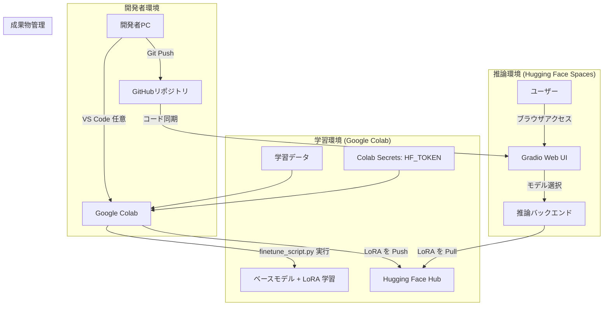

# システムアーキテクチャ設計書

本ドキュメントは、「LLM学習・推論お試しセット」プロジェクトのシステムアーキテクチャを定義します。

## 1. システム構成図

本システムは、以下のコンポーネントで構成されます。各サービスはインターネットを介して連携します。

## 2. コンポーネント詳細

| コンポーネント | 利用サービス | 役割 | 備考 |
| :--- | :--- | :--- | :--- |
| **開発環境** | ローカル PC | コード編集、`params.yaml` 編集、テスト実行 | GPU 不要の検証は `tests/` |
| **学習環境** | Google Colab | `finetune_script.py` による LoRA 学習 | T4 GPU 想定 |
| **推論環境** | Hugging Face Spaces | Gradio でチャット UI を提供 | CPU Basic 想定 |
| **コード管理** | GitHub | 学習・推論コード、設定を管理 | 公開なら clone に PAT 不要 |
| **成果物管理** | Hugging Face Hub | LoRA アダプタを保管 | `hf_lora_repo` で指定 |

## 3. データの流れ

1. **学習フェーズ**:
   1. 開発者は `training/params.yaml` と `data/dataset.jsonl` を GitHub にプッシュする。
   2. Colab で `finetune.ipynb` を **すべて実行**する（初回のみ Secrets に `HF_TOKEN` を登録）。
   3. ノートブックがリポジトリを clone し、`finetune_script.py` を実行する。
   4. スクリプトがベースモデルを取得し、LoRA 学習後に Hub の `hf_lora_repo` へ push する。

2. **推論フェーズ**:
   1. Spaces が GitHub と同期し `inference/app.py` を起動する（構成に依存）。
   2. ユーザーが Gradio UI からアダプタを選択し、Hub から取得して推論する。

## 4. 利用リソースと環境

| 項目 | 学習環境 | 推論環境 |
| :--- | :--- | :--- |
| **プラットフォーム** | Google Colab | Hugging Face Spaces |
| **コンピューティング** | T4 GPU（無料枠） | CPU Basic（無料枠） |
| **SDK / フレームワーク** | Jupyter / スクリプト | Gradio |

## 5. 秘匿情報の管理

- **Hugging Face トークン** (`HF_TOKEN`): リポジトリにコミットしない。
- **ローカル**: `.env` またはシェルの環境変数（`.gitignore` で `.env` を除外）。
- **Google Colab**: **Secrets** に `HF_TOKEN` を登録。プライベート GitHub を clone する場合のみ `GITHUB_TOKEN` を追加。
- **Hugging Face Spaces**: **Settings → Secrets** に `HF_TOKEN` を設定。

## 6. 操作最小化に関する設計判断

- 対話入力は学習パイプラインに含めない。設定は **`params.yaml` + 環境変数**に限定する。
- Colab 上の「人の操作」は、**ランタイム選択**と**すべてのセルを実行**に近づける。完全無人の API 起動は無料 Colab の制約上、本プロジェクトの対象外とする。
