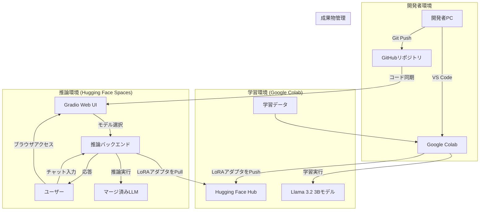

# システムアーキテクチャ設計書

本ドキュメントは、「LLM学習・推論お試しセット」プロジェクトのシステムアーキテクチャを定義します。

## 1. システム構成図

本システムは、以下のコンポーネントで構成されます。各サービスはインターネットを介して連携します。

## 2. コンポーネント詳細

| コンポーネント | 利用サービス | 役割 | 備考 |
| :--- | :--- | :--- | :--- |
| **開発環境** | ローカルPC | コード開発、Git操作 | VS Code + Google Colab拡張機能を利用 |
| **学習環境** | Google Colab | LLMのファインチューニング（LoRA学習）を実行 | 無料版 T4 GPU を想定 |
| **推論環境** | Hugging Face Spaces | 学習済みモデルをデプロイし、チャットUIを提供 | 無料版 CPU Basic を想定 |
| **コード管理** | GitHub | 学習・推論コード、設定ファイル等を一元管理 | |
| **成果物管理** | Hugging Face Hub | 学習済みLoRAアダプタ、データセット等を保管・共有 | |

## 3. データの流れ

1.  **学習フェーズ**:
    1.  開発者は GitHub から学習コード (`finetune.ipynb`) を Google Colab 環境に展開します。
    2.  Colab 上で学習データ (`dataset.jsonl`) を読み込みます。
    3.  ベースモデル（Llama-3.2-3B-Instruct）をロードし、`Unsloth` を用いて LoRA ファインチューニングを実行します。
    4.  学習完了後、生成された LoRA アダプタを Hugging Face Hub の指定リポジトリにアップロードします。

2.  **推論フェーズ**:
    1.  Hugging Face Spaces は GitHub リポジトリと同期し、推論アプリケーション (`app.py`) をデプロイします。
    2.  ユーザーがブラウザで Gradio UI にアクセスします。
    3.  アプリケーションは Hugging Face Hub API を利用して、利用可能な LoRA アダプタのリストをプルダウンメニューに表示します。
    4.  ユーザーがプルダウンからアダプタを選択すると、推論バックエンドが該当アダプタを Hugging Face Hub からダウンロードします。
    5.  ベースモデルに選択された LoRA アダプタを動的にマージします。
    6.  ユーザーがチャットで入力したプロンプトを、マージ済みのモデルで推論し、結果をUIに返します。

## 4. 利用リソースと環境

| 項目 | 学習環境 | 推論環境 |
| :--- | :--- | :--- |
| **プラットフォーム** | Google Colab | Hugging Face Spaces |
| **コンピューティング** | T4 GPU (無料枠) | CPU Basic (無料枠) |
| **SDK / フレームワーク** | - | Gradio |
| **主要言語** | Python 3.10+ | Python 3.10+ |
| **ネットワーク** | インターネット経由で GitHub, Hugging Face Hub にアクセス | インターネット経由で GitHub, Hugging Face Hub にアクセス |

## 5. 秘匿情報の管理

- **Hugging Face トークン** (`HF_TOKEN`) などの秘匿情報は、Gitリポジトリに直接コミットしません。
- **ローカル開発時**: `.env` ファイルに記述し、`.gitignore` で管理対象外とします。
- **Google Colab**: Colab の `secrets` 機能を使用して環境変数を設定します。
- **Hugging Face Spaces**: Spaces の `Settings > Secrets` 機能を使用して環境変数を設定します。
